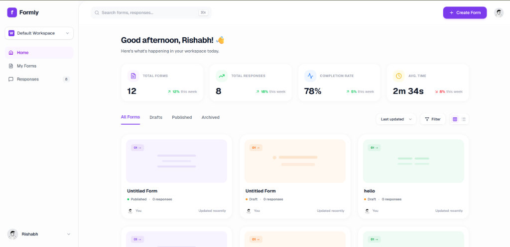
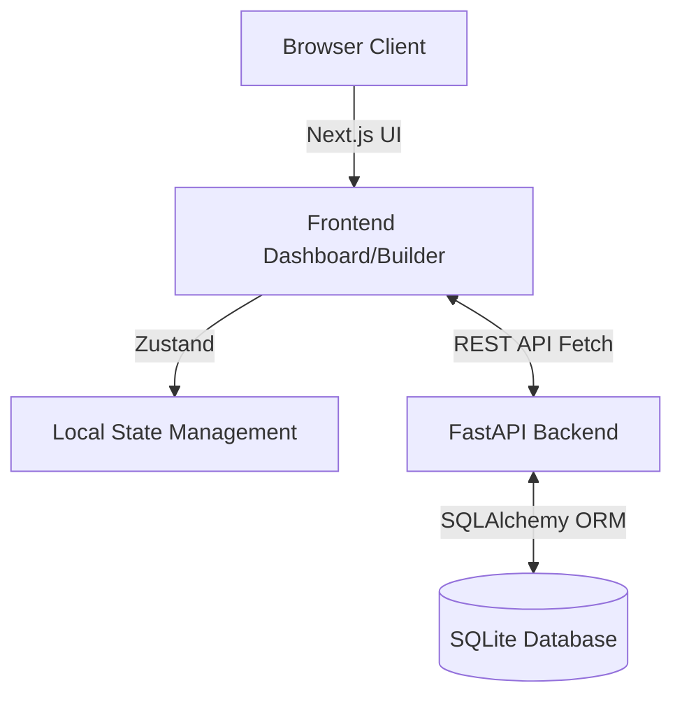

# 🚀 Formly (Typeform Clone)

> A beautiful, high-fidelity clone of the Typeform application, replicating its core form-building, form-filling, and analytics workflows.

<div align="center">
  
</div>

## ✨ Features

- **🎨 Beautiful Form Builder**: Intuitive drag-and-drop question ordering, theme customization, and font-size adjustments.
- **📝 Seamless Respondent UI**: Smoothly transition between questions with keyboard-driven navigation (just press `Enter`!).
- **📊 Real-time Dashboard**: Track KPIs like total responses, completion rates, and average completion time.
- **📁 Workspaces**: Organize your forms into isolated workspaces.
- **📤 Data Import/Export**: Import questions via `.csv` / `.txt` and export form responses as `.csv`.
- **⚡ Conditional Logic**: Configure conditional branches to skip or show specific questions.
- **🌗 Theming**: Switch the form respondent theme instantly between Light and Dark mode.

---

## 🛠️ Tech Stack

| Layer | Technologies |
|---|---|
| **Frontend** | Next.js 14 (App Router), TypeScript, Tailwind CSS, Framer Motion, Zustand, dnd-kit |
| **Backend** | Python, FastAPI, SQLAlchemy (ORM) |
| **Database** | SQLite |

---

## 🏗️ Architecture



1. **Creator Flow**: Creators start at the Dashboard (`/`), where they can view and create forms. The Form Builder (`/form/[id]`) uses `Zustand` to manage local state for lightning-fast edits, and `@dnd-kit` for drag-and-drop question reordering. 
2. **Respondent Flow**: The public UI (`/to/[id]`) fetches the published form data and uses `framer-motion` to smoothly transition between questions one at a time. It captures keyboard inputs (Enter) and submits the final payload to `POST /api/public/forms/{id}/responses`.
3. **Results**: Creators can view tabular response data at the Results Dashboard (`/results/[id]`), which aggregates the submitted answers.

---

## 🗄️ Database Schema

The database uses 6 core tables to manage application state:
- **`users`**: Mocked creator accounts (`id`, `name`, `email`).
- **`workspaces`**: Logical containers to group forms.
- **`forms`**: Form metadata (`id`, `creator_id`, `title`, `status`, `created_at`).
- **`questions`**: The form fields (`id`, `form_id`, `type`, `title`, `description`, `is_required`, `options`).
- **`responses`**: Represents a single submission session (`id`, `form_id`, `submitted_at`).
- **`answers`**: The individual answers tied to a response (`id`, `response_id`, `question_id`, `value`).

---

## 🚀 Getting Started

### Prerequisites

- Node.js (v18+)
- Python (3.10+)

### 1️⃣ Backend Setup

```bash
cd backend
python -m venv venv

# Windows
.\venv\Scripts\activate
# Mac/Linux
source venv/bin/activate

pip install -r requirements.txt
python init_db.py
python seed.py
uvicorn app.main:app --reload --port 8000
```

### 2️⃣ Frontend Setup

```bash
cd frontend
npm install
npm run dev
```

### 3️⃣ Usage

- Navigate to `http://localhost:3000` to access the creator dashboard. 
- The backend API docs are available at `http://localhost:8000/docs`.

---

## 🐙 How to push to GitHub

To push this completely finished project to your GitHub repository, run the following commands in the root of your project:

```bash
# Initialize git if you haven't already
git init

# Add all files to staging
git add .

# Commit the changes
git commit -m "Initial commit: Formly Typeform Clone completed"

# Link your repository (Replace URL with your actual GitHub repo URL)
git remote add origin https://github.com/your-username/your-repo-name.git

# Push to the main branch
git branch -M main
git push -u origin main
```

---

## 🧠 Design Decisions & Assumptions

> [!NOTE]
> **Authentication**: As per the instructions, real creator authentication is simplified. A default `test-user-id` is automatically injected into the database and used for all creator actions.

> [!TIP]
> **Form Syncing**: To keep the drag-and-drop UI fast, the form builder relies entirely on local state (Zustand) until the user explicitly clicks the "Publish" button, which performs a bulk replacement of the questions in the database.

> [!WARNING]
> **Public Forms**: Draft forms cannot be accessed by respondents. The API strictly blocks fetching forms unless `status == 'published'`.